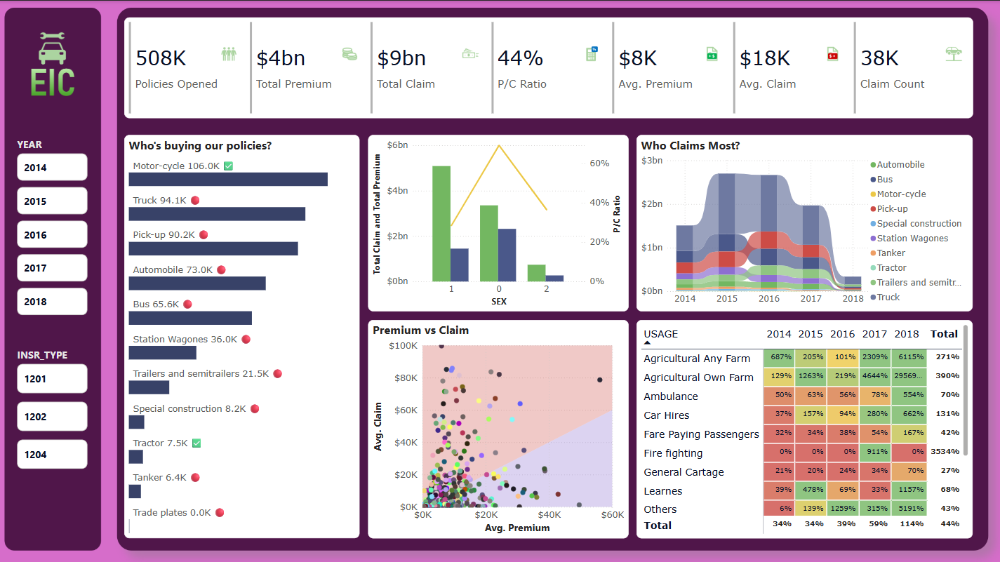

# 📊 Data Visualization Portfolio

Welcome to my data visualization portfolio! This repository showcases a collection of dashboards built with **Power BI** and **Tableau**. These projects demonstrate my ability to turn raw data into actionable insights using interactive visuals, storytelling, and domain knowledge across different industries.

---

## 🧰 Tools Used
- **Power BI**
- **Tableau**
- **Excel / SQL (for data preprocessing, where applicable)**

---

## 📈 Tableau Projects

### 1. Sales Dashboard  
An interactive dashboard providing an overview of sales performance across resellers, product, and time periods. It highlights key metrics like revenue, customer count, and growth trends.

---

### 2. Human Resource Dashboard  
This HR dashboard tracks employee distribution, turnover, hiring trends, and diversity metrics. Designed to support HR decision-making and workforce planning.

---

## 📊 Power BI Projects

### 1. Pareto Table – Top Contributing Products  
A Power BI visual that applies the Pareto Principle to help identify the products contributing to X% of the total revenue. It includes cumulative contribution and filtering by year or product type.

---

### 2. Insurance Dashboard  
Interactive dashboard focused on claims, policies, and customer segmentation. It helps stakeholders assess risk profiles, claim trends, and operational KPIs.

---

### 3. Telecom Usage Monitoring Dashboard  
Tracks customer usage behavior across voice, SMS, and data plans. Built to support churn analysis, plan optimization, and usage trend reporting.

